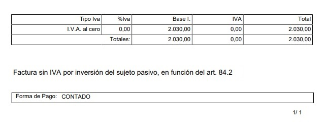

**¿Te has preguntado cómo la inversión del sujeto pasivo del IVA puede transformar la gestión fiscal de tu negocio? En esta guía completa, desglosamos todo lo que necesitas saber sobre este mecanismo, sus implicaciones y cómo aprovecharlo al máximo para optimizar tus operaciones y minimizar riesgos. ¡Sigue leyendo!**

Antes de comenzar a ver qué es la inversión del sujeto pasivo del IVA, hay que tener claro el concepto de "Sujeto pasivo": El **sujeto pasivo del IVA se refiere a la persona física o jurídica responsable de cumplir con las obligaciones tributarias relacionadas con este impuesto**. En otras palabras, es el vendedor o prestador de servicios que debe liquidar el IVA a la administración tributaria. Aunque el contribuyente, que es el consumidor final, soporta efectivamente la carga del impuesto, el sujeto pasivo es quien tiene la obligación de recaudarlo y remitirlo al fisco.

En resumen, el sujeto pasivo actúa como intermediario entre el estado y el consumidor, gestionando la recaudación del impuesto sobre el valor añadido en cada transacción.

## ¿Qué es la inversión del sujeto pasivo del IVA?

**La inversión del sujeto pasivo en el IVA es un mecanismo mediante el cual la responsabilidad de ingresar el IVA no recae en el vendedor, como ocurre normalmente, sino en el comprador.** Esta medida es utilizada en ciertos casos específicos, sobre todo en operaciones entre empresas, tanto a nivel nacional como en el ámbito de la Unión Europea.

Si necesitas hacer cálculos precisos de IVA, ya sea para una operación estándar o en situaciones más complejas como la inversión del sujeto pasivo, **te recomendamos utilizar nuestra calculadora para [calcular el IVA](https://calculadora-de-iva.es/)**. Con ella podrás obtener los resultados de forma rápida y sencilla.

La clave de la inversión del sujeto pasivo es que **el comprador se convierte en el responsable de autoliquidar el IVA**. Este procedimiento se creó principalmente para evitar el fraude fiscal en situaciones donde el vendedor, tras cobrar el IVA, no lo ingresa en Hacienda. En lugar de esto, el comprador es quien debe reflejar el IVA en su declaración, aportando transparencia y control en el proceso.

Este mecanismo es **común en sectores como el de la construcción o en las operaciones intracomunitarias**, y requiere cumplir con ciertas normativas específicas para poder aplicarse correctamente.

## ¿Cuándo se aplica la inversión del sujeto pasivo en IVA?

Este mecanismo no se aplica en cualquier tipo de operación. Se utiliza específicamente en los siguientes casos:

- **Operaciones intracomunitarias**: Tal y como hemos visto, se aplica cuando una empresa dentro de la Unión Europea vende bienes o servicios a otra empresa ubicada en otro país miembro.

- **Sector de la construcción**: En este sector, es común que se aplique la inversión del sujeto pasivo, ya que grandes empresas pueden delegar la responsabilidad del IVA a los contratistas que realizan el trabajo.

- **Transacciones nacionales específicas**: En algunos países, ciertas operaciones con bienes inmuebles, residuos o servicios de telecomunicaciones también pueden estar sujetas a este régimen.

## Requisitos para aplicar la inversión del sujeto pasivo

Para poder aplicar la inversión del sujeto pasivo, se deben cumplir ciertos requisitos clave:

- **Ambas partes deben ser empresas o personas jurídicas**: Este mecanismo no se aplica cuando el comprador es un particular.

- **Registro en el ROI**: Las empresas que participan en transacciones intracomunitarias deben estar registradas en el Registro de Operadores Intracomunitarios.

- **Verificación del transporte de bienes**: Es esencial demostrar que ha habido una circulación de bienes entre los países de la operación.

- **Declaración Intracomunitaria**: Los bienes deben ser declarados ante las autoridades fiscales pertinentes para asegurar que la operación está documentada correctamente.

## Inversión del sujeto pasivo IVA: ejemplos

Entender cómo se aplica este mecanismo es más fácil con ejemplos concretos:

### Ejemplo 1: Compra de maquinaria entre dos empresas europeas

Una empresa española compra maquinaria a una empresa alemana. La factura emitida por la empresa alemana no incluye el IVA, ya que se aplica la inversión del sujeto pasivo. La empresa española es quien declara el IVA en España.

### Ejemplo 2: Servicio de construcción en territorio español

Un autónomo español realiza trabajos de construcción para una gran empresa. En este caso, el autónomo emite una factura sin IVA, especificando que el cliente debe encargarse de ingresar el impuesto en su declaración.

### Ejemplo 3: Compra de productos electrónicos a nivel internacional

Una empresa en España compra productos informáticos a una empresa francesa. La factura se emite sin IVA, pero la empresa española es responsable de liquidar el IVA ante Hacienda en su país.

## Beneficios y desafíos de la inversión del sujeto pasivo

El principal beneficio de la inversión del sujeto pasivo es la **prevención del fraude fiscal**, especialmente en operaciones internacionales donde puede haber menos control. Además, ayuda a las empresas a gestionar mejor el IVA en sus transacciones, evitando pagos duplicados o errores en la facturación.

Sin embargo, no está exento de desafíos. Uno de los principales problemas es que **las empresas deben tener un conocimiento preciso de la normativa y cumplir con requisitos específicos**, como el registro en el ROI o la correcta emisión de facturas. Además, el comprador debe estar preparado para autoliquidar el IVA en tiempo y forma.

## Cómo emitir facturas bajo la inversión del sujeto pasivo

Cuando se emite una factura bajo la inversión del sujeto pasivo, **es crucial especificar claramente que no se incluye el IVA y que la responsabilidad del ingreso del impuesto recae sobre el comprador**. Además, se deben cumplir los siguientes pasos:

1. Emitir la factura sin IVA, con la mención explícita: "Operación sujeta a inversión del sujeto pasivo según el artículo X del IVA".

3. Verificar que el cliente cumple con los requisitos, especialmente en operaciones intracomunitarias.

5. Llevar un control riguroso de las operaciones y declararlas correctamente en la contabilidad.

## Impacto de la inversión del sujeto pasivo en la fiscalidad empresarial

Para las empresas que operan a nivel internacional, la inversión del sujeto pasivo puede ser una herramienta muy útil para gestionar de forma eficiente sus impuestos. Permite evitar complicaciones relacionadas con el IVA en transacciones intracomunitarias, pero también implica que las empresas deben tener sistemas contables capaces de manejar este tipo de operaciones correctamente.

La correcta aplicación de este régimen puede evitar errores fiscales, pero es importante que tanto el emisor como el receptor de la factura estén alineados en cuanto a la normativa y los procedimientos.

## Preguntas frecuentes sobre la inversión del sujeto pasivo en IVA

### **¿Cuándo se produce la inversión del sujeto pasivo en el IVA?**

Se produce cuando la responsabilidad del pago del IVA se transfiere del vendedor al comprador, especialmente en operaciones intracomunitarias o ciertos sectores como la construcción.

### **¿Quién puede facturar con inversión del sujeto pasivo?**

Empresas y autónomos que realicen operaciones con otras empresas dentro de la Unión Europea o en sectores específicos como el de la construcción.

### **¿Cómo se declaran las operaciones con inversión del sujeto pasivo?**

El comprador debe reflejar el IVA en su declaración trimestral y pagar el impuesto correspondiente a la autoridad fiscal.

### **¿Cuándo se aplica la inversión del sujeto pasivo en construcción?**

Cuando un autónomo o una empresa realiza trabajos para una empresa que asume la responsabilidad de autoliquidar el IVA.

### **¿Quién paga el IVA mediante inversión del sujeto pasivo?**

El comprador es quien debe autoliquidar y pagar el IVA en su declaración fiscal.

### **¿Cuándo se aplica el ISP (inversión del sujeto pasivo)?**

Se aplica en operaciones como adquisiciones intracomunitarias, servicios de construcción y otros sectores específicos donde la normativa lo indica.
