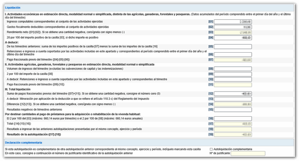

**El modelo 130 es una declaración trimestral que deben presentar los autónomos en España para realizar el pago fraccionado del IRPF (Impuesto sobre la Renta de las Personas Físicas). Este modelo permite a los autónomos adelantar una parte de su impuesto anual, ayudando así a Hacienda a recaudar ingresos de manera anticipada. En este artículo, exploraremos en detalle qué es el modelo 130, quién está obligado a presentarlo, cómo se calcula el pago, los gastos deducibles, y mucho más.**

Para simplificar el proceso de cálculo de tus impuestos, te recomendamos utilizar nuestra **calculadora de IVA**. Esta herramienta te ayudará a calcular automáticamente el IVA de tus facturas, permitiéndote ahorrar tiempo y reducir errores. [**Accede aquí a la calculadora de IVA**](https://calculadora-de-iva.es/) para optimizar tu gestión financiera.

## ¿Qué es el Modelo 130 y por qué es importante para los autónomos?

**El modelo 130 es esencialmente una herramienta de gestión fiscal que permite a los autónomos abonar de forma anticipada el IRPF a lo largo del año, en lugar de esperar a la declaración anual**. Para muchos autónomos, esto representa una forma de distribuir sus obligaciones fiscales, evitando sorpresas desagradables al final del ejercicio fiscal. Este modelo aplica un 20% de retención sobre el beneficio neto trimestral, que es la diferencia entre los ingresos y los gastos deducibles.

> En mi experiencia como autónomo, he encontrado que el modelo 130 no solo **me ayuda a mantenerme al día con mis obligaciones fiscales, sino que también me ofrece una visión clara y periódica de mi situación financiera**. Al presentar este modelo, puedo ajustar mis finanzas personales y empresariales a lo largo del año, lo que me permite tomar decisiones más informadas.

## ¿Quién está obligado a presentar el Modelo 130?

No todos los autónomos están obligados a presentar el modelo 130. La obligación depende de si en tus facturas has aplicado retenciones. **Si al menos el 70% de tu facturación lleva retenciones, entonces no es necesario presentar el modelo 130**. Esto se debe a que las retenciones ya cubren el pago anticipado del IRPF. Sin embargo, si este no es el caso, estarás obligado a presentar el modelo trimestralmente.

Además, **si realizas actividades profesionales donde emites facturas sin retención, o si tus clientes no te retienen el IRPF, entonces debes presentar este modelo** para regularizar tus pagos a lo largo del año. Es crucial evaluar periódicamente tu situación fiscal y la estructura de tus ingresos para determinar si necesitas presentar el modelo 130.

## Criterios para saber si debes presentar el Modelo 130

Para saber si debes presentar el modelo 130, puedes seguir estos criterios básicos:

1. **Retención aplicada en facturas**: Si aplicas una retención en al menos el 70% de tus facturas, no necesitas presentar el modelo 130.

3. **Tipo de actividad**: Las actividades empresariales sin retención o con retención inferior al 70% del total de ingresos están obligadas a presentar el modelo.

5. **Tipo de ingresos**: Ingresos provenientes de actividades profesionales que no llevan retención deben incluirse en el modelo 130.

7. **Cambios en el año fiscal**: Si durante el año cambias tu forma de facturación y superas el umbral del 30% de ingresos sin retención, debes comenzar a presentar el modelo 130 a partir de ese trimestre.

La importancia de estos criterios radica en evitar sanciones por parte de Hacienda y asegurar un flujo de caja adecuado para tu actividad profesional.

## Cómo calcular el pago del Modelo 130

El cálculo del pago del modelo 130 es un proceso relativamente sencillo, pero requiere precisión en la contabilización de ingresos y gastos. El modelo se presenta de manera trimestral, y el cálculo se realiza de la siguiente manera:

1. **Ingresos brutos**: En la primera casilla del modelo 130, debes incluir todos los ingresos obtenidos durante el trimestre.

3. **Gastos deducibles**: En la segunda casilla, se registran todos los gastos que se pueden deducir, incluyendo facturas y tickets de compra.

5. **Beneficio neto**: Calcula la diferencia entre los ingresos y los gastos deducibles. Esta diferencia es el beneficio neto sobre el que se aplicará el porcentaje del IRPF.

7. **Retención del 20%**: Sobre el beneficio neto, se aplica una retención del 20%, que es el importe a pagar a Hacienda.

En mi práctica como autónomo, siempre me aseguro de mantener un registro detallado de todos mis ingresos y gastos durante el trimestre. Esto no solo facilita el proceso de presentación del modelo 130, sino que también garantiza que no se me escapen deducciones importantes que puedan reducir mi obligación tributaria.

### Ejemplo de cálculo paso a paso

Supongamos que en un trimestre has generado ingresos por un total de 10,000 euros y tus gastos deducibles ascienden a 3,000 euros.

- **Beneficio neto**: 10,000 euros - 3,000 euros = 7,000 euros.

- **Retención del 20% sobre beneficio neto**: 7,000 euros x 0.20 = 1,400 euros.

Por lo tanto, deberías presentar y pagar 1,400 euros en concepto de retención del IRPF a través del modelo 130.

Si eres parte de un régimen de franquicia, es crucial entender cómo funciona el IVA franquiciado. Este régimen especial te permite simplificar tus obligaciones fiscales al evitar la facturación del IVA a tus clientes. **Descubre más sobre el IVA franquiciado y cómo gestionarlo correctamente en nuestro artículo [IVA franquiciado: ¿Qué es el Régimen de Franquicia del IVA?](https://calculadora-de-iva.es/iva-franquiciado)**

## Gastos deducibles en el Modelo 130

Los gastos deducibles son aquellos que están directamente relacionados con la actividad profesional y pueden restarse de los ingresos para calcular el beneficio neto. Algunos de los gastos deducibles comunes incluyen:

- **Cuotas de autónomo**: Las cotizaciones a la Seguridad Social son deducibles.

- **Materiales y suministros**: Todo material necesario para el ejercicio de tu actividad.

- **Alquiler de oficina**: Si tienes un espacio de trabajo alquilado, este gasto es deducible.

- **Gastos de personal**: Salarios y cotizaciones de empleados.

- **Servicios profesionales**: Gastos de contabilidad, asesoría, etc.

- **Gastos de difícil justificación**: Hasta el 5% del beneficio, con un límite de 2,000 euros anuales.

Es importante conservar todas las facturas y comprobantes de estos gastos para justificar las deducciones ante Hacienda si es necesario. En mi experiencia, siempre he encontrado útil llevar un control mensual de mis gastos mediante software de gestión, lo que facilita enormemente la presentación del modelo 130.

## Consecuencias de no presentar o pagar el Modelo 130

**No presentar o pagar el modelo 130 puede acarrear sanciones y multas** por parte de Hacienda. Las consecuencias pueden variar desde recargos por pago extemporáneo hasta sanciones más severas en caso de omisión intencionada. Además, la falta de pago puede llevar a un aumento de las obligaciones fiscales acumuladas, afectando negativamente tu flujo de caja.

> En mi caso, me aseguro de revisar mi calendario fiscal al inicio de cada año para marcar las fechas importantes de presentación. **Utilizar recordatorios y software de gestión me ha ayudado a evitar descuidos costosos y mantener mis obligaciones fiscales al día**.

## Exenciones del Modelo 130: ¿Cuándo estás exento de presentar?

Existen ciertas situaciones en las que puedes estar exento de presentar el modelo 130:

1. **Facturación con retención suficiente**: Si el 70% o más de tu facturación está sujeta a retención, no necesitas presentar el modelo.

3. **Ingresos de actividades agrarias**: Algunas actividades agrícolas, ganaderas o forestales pueden tener regímenes fiscales especiales que las eximen de esta obligación.

5. **Actividad sin obligación de retención**: Si tu actividad profesional está estructurada de manera que todos tus ingresos están sujetos a retención, podrías estar exento.

7. **Régimen de módulos**: Autónomos que tributan bajo el régimen de estimación objetiva o módulos tienen un régimen distinto que podría eximirlos.

Es crucial verificar regularmente tu situación fiscal y, si es necesario, consultar con un asesor fiscal para asegurarte de cumplir con todas las normativas aplicables.

## Fechas de liquidación del Modelo 130: Todo lo que necesitas saber

El modelo 130 debe presentarse trimestralmente, con fechas límites específicas para cada periodo:

- **Primer trimestre**: Del 1 al 20 de abril.

- **Segundo trimestre**: Del 1 al 20 de julio.

- **Tercer trimestre**: Del 1 al 20 de octubre.

- **Cuarto trimestre**: Del 1 al 30 de enero del año siguiente.

Presentar dentro de estas fechas es crucial para evitar recargos. En mi experiencia, mantener un calendario fiscal claro y utilizar alertas electrónicas son estrategias efectivas para asegurar la puntualidad en la presentación.

## El régimen de módulos para autónomos: ¿Cuánto se paga?

El régimen de módulos, o estimación objetiva, es una forma de tributación para autónomos que se basa en ciertos indicadores y no en los ingresos y gastos reales. Este régimen está disponible para actividades específicas y establece una cuota fija anual basada en factores como la superficie del local, el número de empleados, y otros indicadores relevantes.

Para determinar cuánto se paga bajo este régimen, es necesario consultar las tablas de módulos que Hacienda publica anualmente. Estas tablas especifican los importes a pagar según la actividad y los indicadores asociados. Aunque el régimen de módulos simplifica el cálculo del impuesto, puede no ser ventajoso para todos, especialmente si los gastos reales son significativamente altos.

## Consejos prácticos para la presentación del Modelo 130

1. **Mantén un registro detallado**: Lleva un registro mensual de todos tus ingresos y gastos para facilitar el cálculo del modelo 130.

3. **Utiliza herramientas digitales**: Herramientas como software de contabilidad pueden automatizar gran parte del proceso, reduciendo errores y ahorrando tiempo.

5. **Consulta con un asesor fiscal**: Si tienes dudas, es recomendable buscar asesoría profesional para asegurar que estás cumpliendo correctamente con tus obligaciones.

7. **Establece un sistema de alertas**: Utiliza recordatorios digitales para las fechas de presentación, asegurando así que no te retrasas.

En mi caso, he encontrado que la automatización del proceso contable me ha permitido concentrarme más en mi actividad profesional, sabiendo que mis obligaciones fiscales están en orden.

## Herramientas y recursos para facilitar el proceso

Existen varias herramientas que pueden facilitar la gestión y presentación del modelo 130:

- **Software de contabilidad**: Programas como Quipu o Contasimple permiten registrar ingresos y gastos, calculando automáticamente el modelo 130.

- **Aplicaciones móviles**: Aplicaciones de contabilidad móvil te permiten registrar transacciones sobre la marcha y tener una visión clara de tu situación financiera en todo momento.

- **Asesoría fiscal online**: Plataformas como Declarando ofrecen servicios de asesoría fiscal y gestión tributaria online, simplificando el cumplimiento fiscal para los autónomos.

## Modelo 130 AEAT: La importancia de una buena gestión fiscal

El modelo 130 es una herramienta crucial para los autónomos en España, asegurando un pago anticipado y ordenado del IRPF a lo largo del año. A través de una correcta presentación y gestión de este modelo, puedes evitar sanciones, optimizar tu situación fiscal y mantener un control financiero sólido.

En mi experiencia, dedicar tiempo a entender y organizar mis obligaciones fiscales ha sido una inversión que me ha permitido enfocarme en el crecimiento de mi negocio. Con las herramientas adecuadas y un enfoque proactivo, la gestión fiscal puede ser mucho más manejable y menos estresante.
